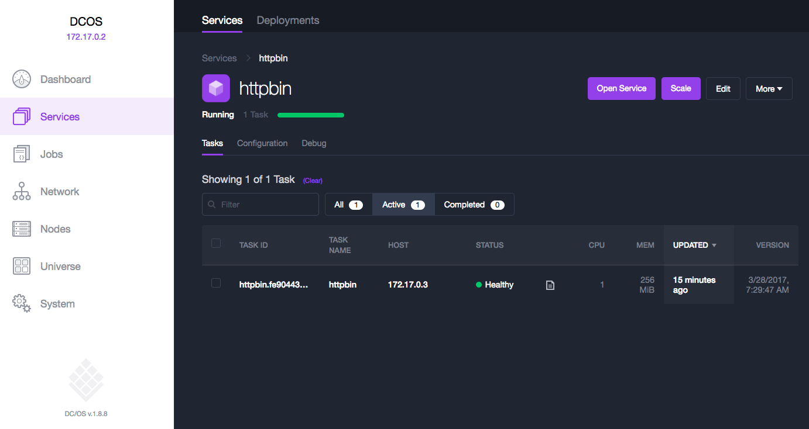
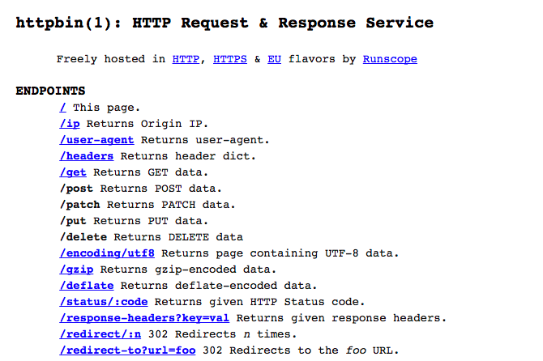

# How to use httpbin on DC/OS

[httpbin](https://github.com/kennethreitz/httpbin) is an HTTP Request &
Response Service, written in Python with the Flask framework. Basically, it's
an HTTP server that responds in predictable ways to special HTTP requests and
echoes back a lot of the data given to it, so that a developer can see what
HTTP client code is doing -- e.g.: what request headers are being set and such.
It is also a fairly simple application and thus it's interesting to look at as
an example of how to package and deploy applications on DC/OS.

- Estimated time for completion: 3 minutes
- Target audience: Software developers who want to use httpbin to test their
  HTTP client code
- Scope: Install and use httpbin in DC/OS.

**Table of Contents**

- [Prerequisites](#prerequisites)
- [Install httpbin](#install-httpbin)
- [Use httpbin](#use-httpbin)
- [Uninstall httpbin](#uninstall-httpbin)

## Prerequisites

- A running DC/OS 1.8 cluster.
- [DC/OS CLI](https://dcos.io/docs/1.8/usage/cli/install/) installed.

## Install httpbin

If you want to access httpbin from outside of the DC/OS cluster you can use
[Marathon-LB](https://dcos.io/docs/1.8/usage/service-discovery/marathon-lb/),
which is recommended for production usage.

In the following we will use the DC/OS [Admin
Router](https://dcos.io/docs/1.8/development/dcos-integration/#-a-name-adminrouter-a-admin-router)
to provide access to httpbin, which is fine for dev/test setups:

```bash
$ dcos package install httpbin
This DC/OS Service is currently EXPERIMENTAL. There may be bugs, incomplete features, incorrect documentation, or other discrepancies. Experimental packages should never be used in production!
Continue installing? [yes/no] yes
Installing Marathon app for package [httpbin] version [1.0.0]
DC/OS httpbin is being installed!

	Documentation: https://github.com/kennethreitz/httpbin
```

After this, you should see the httpbin service running via the `Services` tab of the DC/OS UI:



## Use httpbin

In the DC/OS UI, clicking on the `Open Service` button in the right upper corner leads to httpbin:



To get started with httpbin you can do some HTTP requests with HTTPie or curl.

First we will need to authenticate dcos-cli with your cluster, so that we can
get the Authorization token we need to communicate with the cluster:

```
$ dcos auth login
```

Now you can do an HTTP request to httpbin's `/get` endpoint.

```
$ curl -H "Authorization: token=$(dcos config show core.dcos_acs_token)" -H "Hello: World" $(dcos config show core.dcos_url)/service/httpbin/get
{
  "args": {},
  "headers": {
    "Accept": "*/*",
    "Authorization": "token=ey...",
    "Connection": "upgrade",
    "Hello": "World",
    "Host": "172.17.0.2",
    "User-Agent": "curl/7.29.0"
  },
  "origin": "172.17.0.1",
  "url": "http://172.17.0.2/get"
}
```

Note how httpbin returns back in the JSON response tons of info about the
request it received, including among other things, the standard headers sent by
`curl` as well as the custom `Hello` header that we specified.

As another example, try using httpbin's `/delay/:seconds` endpoint:

```
$ time curl -H "Authorization: token=$(dcos config show core.dcos_acs_token)" -H "Hello: World" $(dcos config show core.dcos_url)/service/httpbin/delay/3
{
  "args": {},
  "data": "",
  "files": {},
  "form": {},
  "headers": {
    "Accept": "*/*",
    "Authorization": "token=ey...",
    "Connection": "upgrade",
    "Hello": "World",
    "Host": "172.17.0.2",
    "User-Agent": "curl/7.29.0"
  },
  "origin": "172.17.0.1",
  "url": "http://172.17.0.2/delay/3"
}

real	0m3.616s
user	0m0.534s
sys	0m0.074s
```

Here httpbin delayed the respone by 3 seconds. This can be useful if working on
code that makes HTTP requests and you want to simulate an unresponsive server.

## Uninstall httpbin

To uninstall httpbin:

```bash
$ dcos package uninstall httpbin
```

## Further resources

1. [httpbin GitHub repo](https://github.com/kennethreitz/httpbin)
1. [httpbin.org](http://httpbin.org/)

