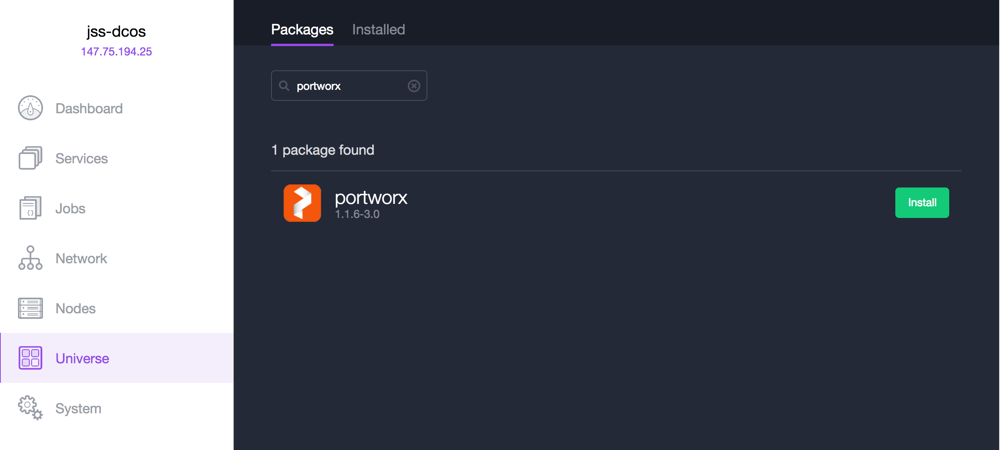
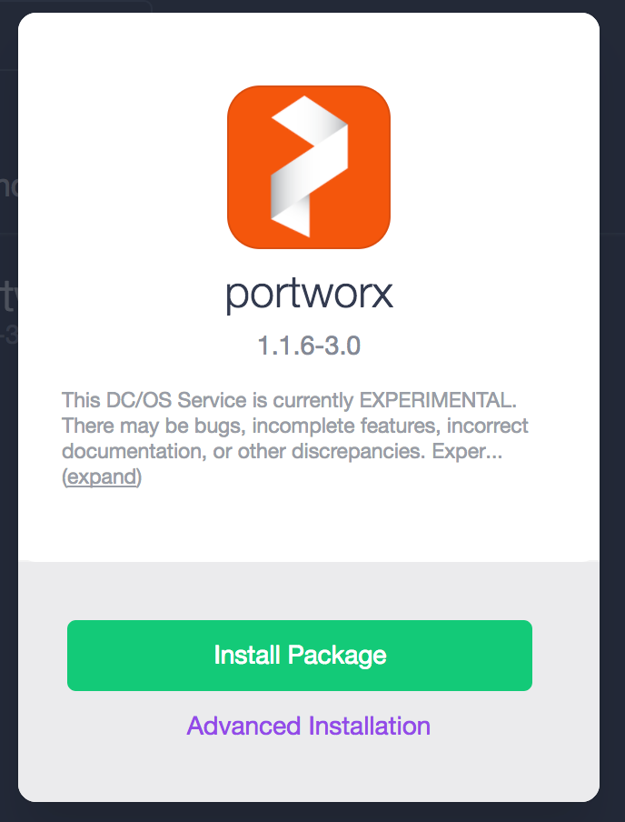
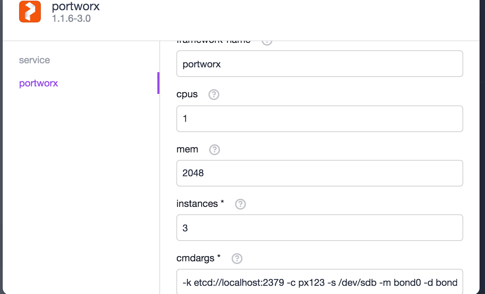
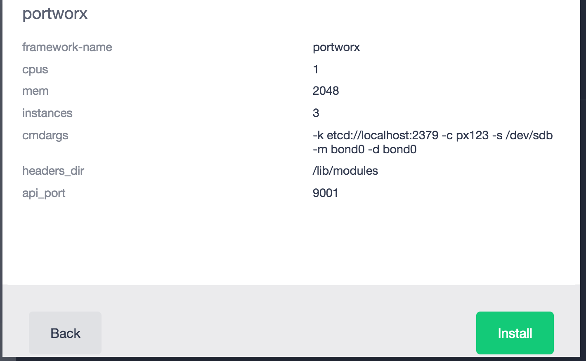
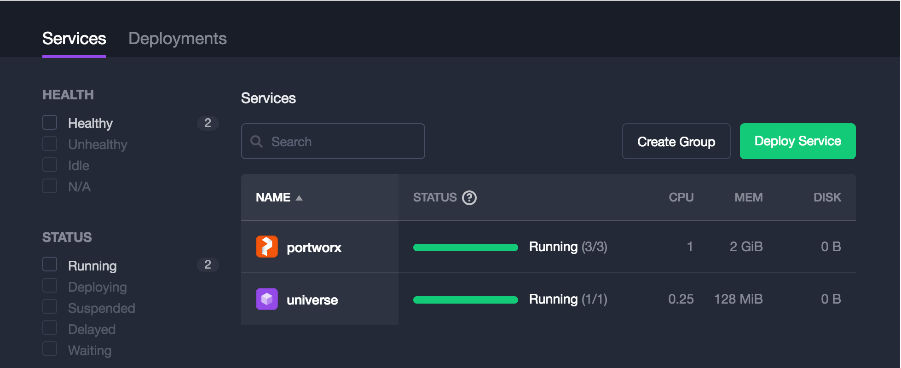
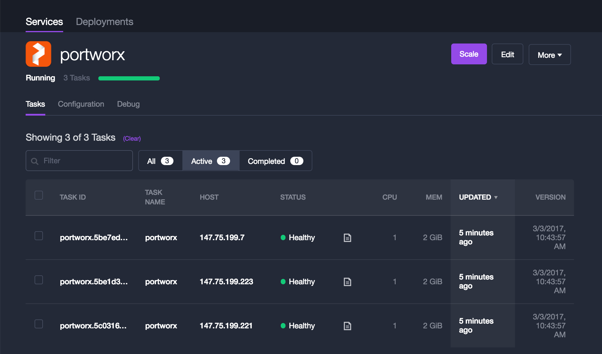

 

Portworx provides scale-out storage for containers. Portworx storage is delivered as a container that is installed on your servers. Portworx technology:

* Provides data protection and container-granular management.
* Enables companies to run multi-cloud with any scheduler.
* Manages storage that is directly attached to servers, from cloud volumes, or provided by hardware arrays.
* Is radically simple.

Portworx technology is available as PX-Developer and PX-Enterprise.

- Estimated time for completion: 45 minutes
- Target audience: Anyone who wants to deploy a persistent elastic data services solution on DC/OS. 
- This package requires an intermediate/advanced DC/OS skill set.


**Table of Contents**:

- [Prerequisites](#prerequisites)
- [Portworx Node configuration](#portworx-agent-node-configuration)
- [Install Portworx](#install-portworx)
- [Use Portworx](#use-portworx)

Please review the main [Portworx on Mesos](http://docs.portworx.com/run-with-mesosphere.html) documentation.

# Prerequisites

- A running DC/OS v1.8 cluster with at least 3 private agents. Portworx-on-Mesos REQUIRES at least 3 nodes for installation.
- All nodes in the cluster that will participate in a Portworx cluster MUST have a separate non-root volume to use.  
- A node in the cluster with a working DC/OS CLI.
- A key/value data store (both **etcd** and **consul** are supported). 

# Portworx Agent-Node configuration

- Portworx can run on Mesos agent nodes that are either on-prem or in the cloud.
- Portworx works best when installed on all nodes in a DC/OS cluster.  If Portworx is to be installed on a subset of the cluster, then:
 * the agent-nodes must include attributes indicating the participate in the Portworx cluster.
 * services that depend on Portworx volumes must specify "constraints" to ensure they are launched on nodes that can access Portworx volumes.
Please review the main [Portworx on Mesos](http://docs.portworx.com/run-with-mesosphere.html) documnentation.

### Launch a key/value data store

Portworx requires an instance of **etcd** or **consul** for cluster meta-data, prior to launching.  Either launch manually or through a Universe package, taking note of the **service address:port**.

Optionally, CoreOS provides an implicit **etcd** instance.

# Install Portworx

## Install Portworx from the DC/OS GUI

Log into DC/OS, go to Universe, and select the Portworx package from Universe. Select `Advanced Installation`.  Advanced Installation is ***MANDATORY***

- ***cmdargs*** : The `cmdargs` parameter is ***MANDATORY*** and includes all the [relevent command line options](http://docs.portworx.com/run-with-docker.html#run-px).

- ***headers_dir*** : Name of directory for system header files.  For CoreOS, this should be "/lib/modules" (default).  For all other OS's, use "/usr/src".

Once the package is configured according to your installation and needs, click on "Review and Install", and finally on "Install".
Confirm that the Portworx service has started properly













## Install Portworx from the DC/OS CLI

Log into a terminal where the DC/OS CLI is installed and has connectivity with the cluster. The mandatory parameters referenced above can be passed as options to the DC/OS CLI by creating a `px-options.json` file with the following content (Modify the values as per your own installation/desire) :

```bash
{
  "service": {
    "name": "portworx"
  },
  "portworx": {
    "framework-name": "portworx",
    "cpus": 1,
    "mem": 2048,
    "instances": 3,
    "cmdargs": "-k etcd://localhost:2379 -c px1234 -s /dev/sdb -m bond0 -d bond0",
    "headers_dir": "/lib/modules",
    "api_port": 9001
  }
}
```

Create and save the `px-options.json` file, then launch the Portworx DC/OS package with:

```bash
dcos package install --yes --options ./px-options.json portworx
```

### Validate from GUI

After installation, the package will be running under the `Services` tab:

### Validate from CLI

After installation, you can check the correct functioning with:

```bash
dcos package list|grep portworx
portworx  1.1.6-3.0  /portworx  ---      Portworx PX provides scheduler integrated data services for containers, such as data persistence, multi-node replication, cloud-agnostic snapshots and data encryption. Portworx itself is deployed as a container and is suitable for both cloud and on-prem deployments.  Portworx enables containerized applications to be persistent, portable and protected.  For DCOS examples of Portworx, please see https://github.com/dcos/examples/tree/master/1.8/portworx and http://docs.portworx.com/run-with-mesosphere.html
```

# Use Portworx

For more detailed description on using Portworx through DCOS and Mesos, please visit  [Portworx on Mesos framework homepage](http://docs.portworx.com/run-with-mesosphere.html)


# Further resources
1. [Portworx doc site ](http://docs.portworx.com)
