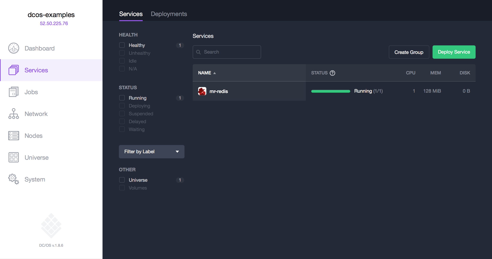

# How to use Redis on DC/OS

[Redis](http://redis.io/) is a popular in-memory data structure store, used as database, cache and message broker.

- Estimated time for completion: 5 minutes
- Target audience: Anyone interested using an in-memory data store.
- Scope: Learn how to use Redis on DC/OS

Note, that there are two different DC/OS services for redis:
- redis: A single redis container, easy to install and test but not suited for production workloads.
- mr-redis: A framework allowing you to mange multiple Redis datastores standalone or in a clustered setup.

**Table of Contents**:


- [Prerequisites](#prerequisites)
- [Use single container redis service](#single-container-redis)
- [mr-redis framework](#mr-redis)
- [Install mr-redis](#install-mr-redis)
- [Create a Redis instance](#create-a-redis-instance)
- [Access the Redis instance](##access-the-redis-instance)
- [Uninstall mr-redis](#uninstall-mr-redis)

## Prerequisites

- A running DC/OS 1.8 cluster with at least 2 nodes with 1 CPU and 128MB of RAM available.
- [DC/OS CLI](https://dcos.io/docs/1.8/usage/cli/install/) installed.

## Single container redis
Note, that this service is targeted at testing redis and not for production workloads!
You can install the single redis container with a simple `dcos package install redis`.
Then the easiest option to test redis is by storing a key manually via the redis-cli
- SSH into node where redis is running: 
``` bash 
dcos node ssh --master-proxy --mesos-id=$(dcos task redis --json | jq -r '.[] | .slave_id')
```
NOTE: This requires you to have the ssh-key required to conenct to the machines added to your local ssh agent (e.g., via ssh-add my_public_key).
- Because redis is running in docker container, we can list all docker containers using docker ps and get the ContainerID.
- Connect to a bash session to the running container: `sudo docker exec -i -t CONTAINER_ID /bin/bash`
- Start the redis CLI: redis-cli
  - Set key i`set mykey key1`
  - Check value is there `get mykey`

##  mr-redis
The DC/OS service [mr-redis](https://github.com/mesos/mr-redis), maintained by [Huawei](http://www.huawei.com/en/)
is a Mesos framework allowing you to manage Redis datastores standalone or in a clustered setup.

## Install mr-redis

To install mr-redis from the DC/OS CLI, do the following:

```bash
$ dcos package install mr-redis
In order for redis framework to start successfully it requires atleast 1 CPU and 128MB of RAM including ports.
Note that the service is alpha and there may be bugs, including possible data loss, incomplete features, incorrect documentation or other discrepancies.
Continue installing? [yes/no] yes
Installing Marathon app for package [mr-redis] version [0.0.1]
Once the cluster initializes download cli from https://github.com/mesos/mr-redis/releases/download/v0.01-alpha/mrr and follow the instructions in github.com/mesos/mr-redis README on how to initialize the cli, you could also use the REST api's directly to create redis instances
```
To validate that the mr-redis service is running and healthy you can go to the DC/OS UI:



Note that the mr-redis framework scheduler is serving on `mrredis.mesos:5656`.

## Create a Redis instance

While the mr-redis service we installed in the previous step is capable of supervising Redis instances, you will need to download the `mrr`, the mr-redis CLI to create and delete Redis instances. So, let's install the `mrr` (from within the DC/OS cluster):

```bash
$ dcos node ssh --master-proxy --leader

core@ip-10-0-6-55 ~ $ curl -s -L https://github.com/mesos/mr-redis/releases/download/v0.01-alpha/mrr_linux_amd64 -o mrr
core@ip-10-0-6-55 ~ $ chmod +x mrr
core@ip-10-0-6-55 ~ $ ./mrr init http://mrredis.mesos:5656
```

Now that we have `mrr` installed, we want to create a Redis instance with the name `test`, a memory capacity of 500 MB and 3 Redis slaves,
so we do the following:

```bash
core@ip-10-0-6-55 ~ $ ./mrr create --name test --memory 500 --slaves 3 --wait
Attempting to Creating a Redis Instance (test) with mem=500 slaves=3
Instance Creation accepted............
Instance Created.
```

To validate if the Redis Master and the three Redis slaves have been created and to discover their endpoints, execute the following command:

```bash
core@ip-10-0-6-55 ~ $ ./mrr status --name test
Status = RUNNING
Type = MS
Capacity = 500
Master = 10.0.3.226:6380
	Slave0 = 10.0.3.226:6381
	Slave1 = 10.0.3.229:6380
	Slave2 = 10.0.3.229:6381
```

## Access the Redis instance

Once you've created the Redis instance, you will want to try it out. For this we will directly talk the [Redis protocol](http://redis.io/topics/protocol) using `netcat` in a Docker container (`appropriate/nc`) to send Redis [commands](http://redis.io/commands) to the Redis instance we've set up previously.

To access and test the Redis instance, do the following (within the DC/OS cluster and using your own Redis Master address, `10.0.3.226:6380` in our example):

```bash
core@ip-10-0-6-55 ~ $ docker run -it --rm appropriate/nc 10.0.3.226 6380
PING
+PONG
SET somekey somevalue
+OK
GET somekey
$9
somevalue
SET anotherkey :42
+OK
GET anotherkey
$3
:42
QUIT
+OK
```
## Uninstall mr-redis

To uninstall mr-redis:

```bash
$ dcos package uninstall mr-redis
```

## Further resources

1. [DC/OS mr-redis Official Documentation](https://github.com/mesos/mr-redis)
1. [Redis commands](http://redis.io/commands)
1. [Redis protocol](http://redis.io/topics/protocol)
1. [netcat](https://hub.docker.com/r/appropriate/nc/) Docker image

